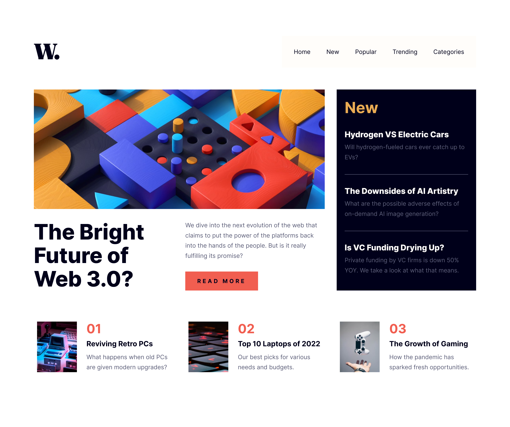

# Frontend Mentor - News homepage solution

This is a solution to the [News homepage challenge on Frontend Mentor](https://www.frontendmentor.io/challenges/news-homepage-H6SWTa1MFl). Frontend Mentor challenges help you improve your coding skills by building realistic projects.

## Table of contents

- [Overview](#overview)
  - [The challenge](#the-challenge)
  - [Screenshot](#screenshot)
  - [Links](#links)
- [My process](#my-process)
  - [Built with](#built-with)
  - [What I learned](#what-i-learned)
  - [Useful resources](#useful-resources)
- [Author](#author)

## Overview

### The challenge

Users should be able to:

- View the optimal layout for the interface depending on their device's screen size
- See hover and focus states for all interactive elements on the page

### Screenshot



### Links

- Solution URL: [Github](https://github.com/Em3ka/news-homepage)
- Live Site URL: [News Homepage](https://news-homepage-psi-inky.vercel.app)

## My process

### Built with

- Semantic HTML5 markup
- CSS custom properties
- Flexbox
- CSS Grid
- Mobile-first workflow

### What I learned

I learned how to control the `::before` pseudo-element so it only shows when the menu is opened and hides immediately before the menu closes.

```css
.navbar__menu::before {
  content: "";
  position: absolute;
  right: 100%;
  top: 0;
  width: 7.5rem;
  height: 100%;
  background-color: var(--very-dark-blue);
  opacity: 0;
  transition: opacity 0.3s ease-in-out;
  pointer-events: none;
}

.before-visible::before {
  opacity: 0.5;
}

.navbar__menu.closed::before {
  transition: opacity 0s;
}
```

```js
function toggleMenu(open) {
  if (window.innerWidth < maxWidth) {
    if (open) {
      navbarMenu.style.visibility = "visible";
      navbarMenu.classList.add("active");
      navbarMenu.classList.remove("closed");
      body.classList.add("no-scroll");

      setTimeout(() => navbarMenu.classList.add("before-visible"), 500);
    } else {
      navbarMenu.classList.remove("before-visible");
      navbarMenu.classList.remove("active");
      navbarMenu.classList.add("closed");
      body.classList.remove("no-scroll");
      setTimeout(() => (navbarMenu.style.visibility = "hidden"), 500);
    }
  }
}
```

### Useful resources

- [Image reset by Kevin Powell](https://youtu.be/345V2MU3E_w?si=eErQOfq9bOOhCWIC) - I really liked this image reset and will use it going forward.

## Author

- Frontend Mentor - [@em3ka](https://www.frontendmentor.io/profile/em3ka)
